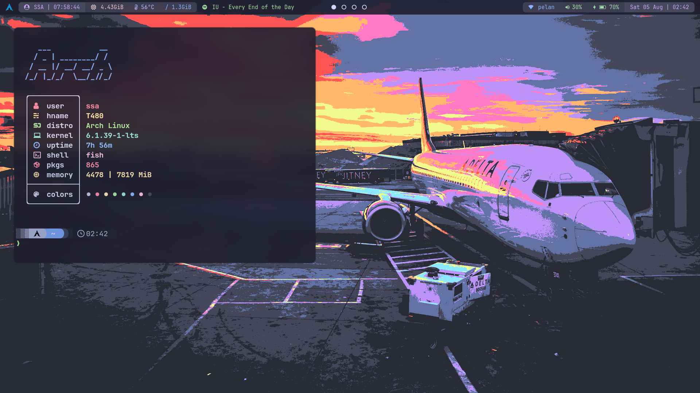
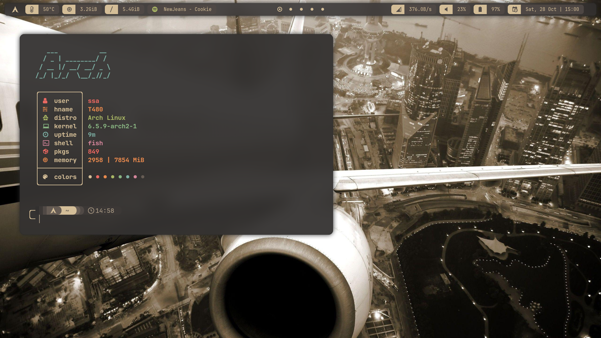

<h1 align="center">DOTFILES</h1>

> ~~I use Arch btw~~

## [Hyprland - Catppuccin](./hyprland-catppuccin/)

First Wayland rice, Wayland + Hyprland is fun!

### **What you see**
- [`ArchLinux`](https://archlinux.org/), the distro.
- [`Hyprland`](https://github.com/hyprwm/Hyprland), the compositor.
- [`Waybar`](https://github.com/Alexays/Waybar/), the bar.
- [`Catppuccin`](https://github.com/catppuccin/catppuccin), the color scheme.
- [`Alacritty`](https://github.com/alacritty/alacritty), the terminal.
- [`Rofi`](https://github.com/davatorium/rofi), the application launcher.
- [`JetBrainsMono Nerd Font`](https://github.com/ryanoasis/nerd-fonts), the font.

## [SwayFX - Gruvbox](./sway-gruvbox/)

Hyprland fun ends when running game, Sway(FX) here we goo.

### **What you see**
- [`Swayfx`](https://github.com/WillPower3309/swayfx), the compositor.
- [`Waybar`](https://github.com/Alexays/Waybar/), the bar.
- [`Gruvbox`](https://github.com/sainnhe/gruvbox-material), the color scheme.
- [`Kitty`](https://github.com/kovidgoyal/kitty), the terminal.
- [`Starship`](https://github.com/starship/starship), the shell prompt.
- [`Rofi`](https://github.com/davatorium/rofi), the application launcher.
- [`JetBrainsMono Nerd Font`](https://github.com/ryanoasis/nerd-fonts), the font.
- [`sinomor1's posts at Unixporn`](https://www.reddit.com/r/unixporn/comments/15ewlmt/awesome_new_wm_new_rice/?utm_source=share&utm_medium=web2x&context=3), the inspiration.
